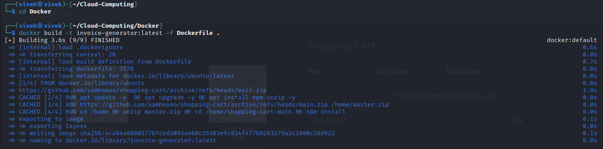
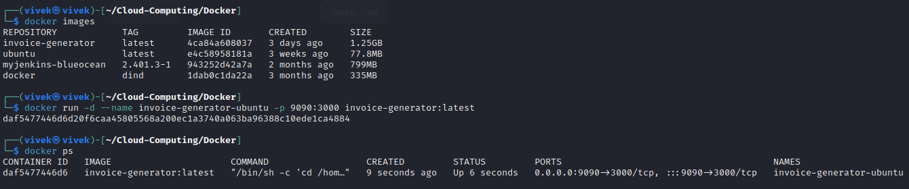
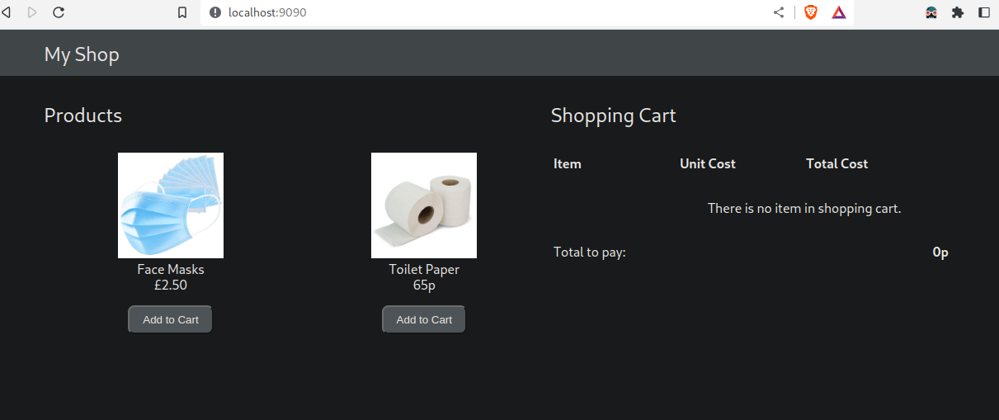

# Invoice Generator Dockerization

This guide will walk you through the process of creating a Docker container for an invoice generator application. By containerizing your application, you can ensure consistent and reliable deployment across different environments.

## Step 1: Create a Dockerfile and Build the Docker Image

1. **Create a Dockerfile**: Start by creating a `Dockerfile` in the root directory of your project. The `Dockerfile` is used to define the image's configuration and dependencies.

    ```Dockerfile
	# Use the official Ubuntu base image
	FROM ubuntu

	# Set environment variables for the GitHub repository and project name
	ENV links https://github.com/samhoooo/shopping-cart/archive/refs/heads/main.zip
	ENV name shopping-cart-main

	# Update and upgrade packages and install npm and unzip
	RUN apt update -y && apt upgrade -y && apt install npm unzip -y

	# Add the project source code from the specified GitHub repository
	ADD $links /home/master.zip

	# Unzip the project source code and navigate to the project directory
	RUN cd /home && unzip master.zip && cd /home/$name && npm install

	# Set the working directory and start the application
	CMD cd /home/$name && npm start
	```

2. **Build the Docker Image**: To build the Docker image, open your terminal and navigate to the project directory. Run the following command:

    ```bash
    docker build -t invoice-generator:latest -f Dockerfile .
    ```

    This command will create a Docker image tagged as `invoice-generator:latest` based on the `Dockerfile`.



## Step 2: Run the Docker Image

3. **Run the Docker Image**: To run the Docker image, use the following command:

    ```bash
    docker run -d --name invoice-generator-ubuntu -p 9090:3000 invoice-generator:latest
    ```

    - `-d` runs the container in detached mode.
    - `--name` specifies a name for the running container.
    - `-p` maps port 9090 on your host to port 3000 in the container.
    - `invoice-generator:latest` is the name and tag of the Docker image to run.



    Your invoice generator application is now running in a Docker container and accessible on `http://localhost:9090`.


